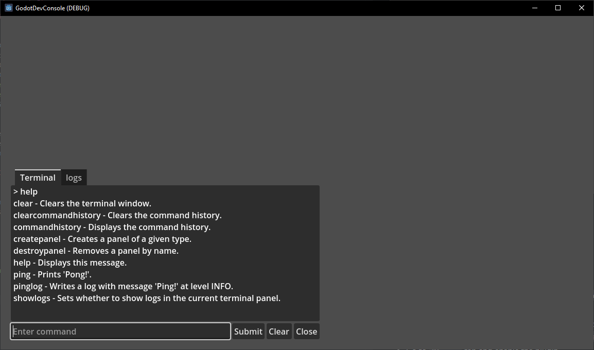

# Godot Dev Console
A in game developer console made in C#.

# Getting started
## Installation
- Download the project
- copy `addons/godotdevconsole` into your projects `addons/` folder
- Build your project
- Open project settings and go to `Input Map` tab and add actions for `dev_console_toggle`, `dev_console_terminal_history_up` and `dev_console_terminal_history_down`
- Go to `Plugins` tab and enable the plugin

## Usage
Press whatever you set the `dev_console_toggle` action to in game and you should see the console pop up ready for you to enter commands, type `help` for a list of commands and what they do.

# Commands

## Creating commands
Simply add the `[Command]` attribute to any `static` function and make sure its last parameter is of type `TerminalPanel`. You can optional pass a name, a array of aliases and a description. If no name is passed the name of the function will be used. The following are a few examples:
- `[Command(Aliases = new string[] { "alias" })]`
- `[Command(Description = "This is the description of my command")]`
- `[Command("Command name", Aliases = new string[] { "alias" }, Description = "This is the description of my command")]`
- For more examples look at the built in commands [here](https://github.com/Logtism/godotdevconsole/tree/master/addons/godotdevconsole/panels/terminal/scripts/commands)

## Built in commands
- `clear` Clears the current terminal panel.
- `clearcommandhistory` Clears the current terminal panels command history.
- `commandhistory` Displays the current terminal panels command history.
- `createpanel` Creates a panel of a given type.
- `destroypanel` Removes a panel by name.
- `help` Displays a list of command or more detailed infomation about a command.
- `ping` Prints 'Pong!'.
- `pinglog` Writes a log with message 'Ping!' and level INFO.
- `showlogs` Sets whether to show logs in the current terminal panel.

# Panels

## Creating panels
- Create a scene with a name ending in `_panel.tscn` for example `debug_panel.tscn`.
- Create a C# script that inherits from `GodotDevConsole.Panel`. 
- Attach the script that inherits `GodotDevConsole.Panel` to the root node of the scene.
- Open project settings and find `addons/godotdevconsole/panels_paths` and add the path to the scene to the list.

## Built in panels
- `terminal` A terminal like panel allowing for commands to be entered and get their output.
- `log` A panel that displays logs from any loggers using the `DevConsoleHandler` log handler.

# Roadmap
- [x] Create log handler for creating log files
- [ ] Make console work without needing input actions
- [ ] Add auto completing in the terminal panel

# Contributing
Instructions on how you can contribute and give back to the project can be found in [CONTRIBUTING.md](). Any help is greatly appreciated.

# License
Distributed under the MIT License. See [LICENSE](https://github.com/Logtism/godotdevconsole/blob/master/LICENSE) for more information.

# Acknowledgments
- [Choose an open source license](https://choosealicense.com/)
- [Best-README-Template](https://github.com/othneildrew/Best-README-Template)

# Inspirations
- [Quantum console](https://assetstore.unity.com/packages/tools/utilities/quantum-console-211046)
- [Sofia Console](https://github.com/LauraWebdev/SofiaConsole/tree/main)
